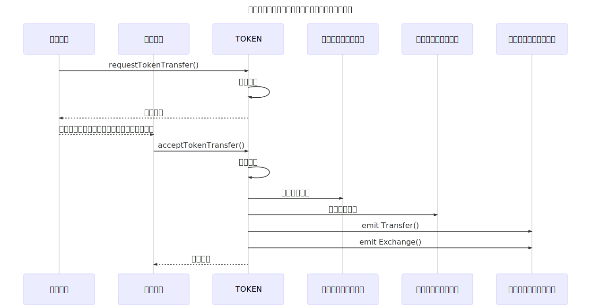
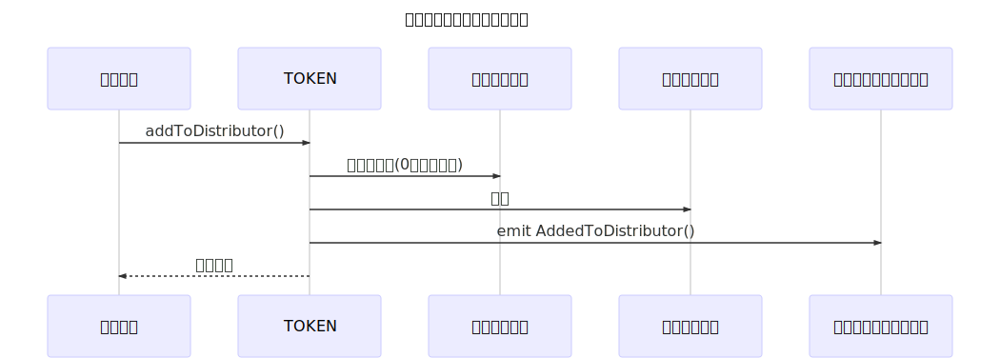
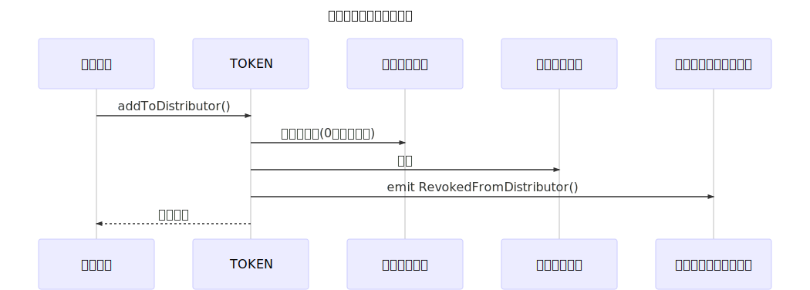

# Implementation of "Internal Distribution Token"

*Read this in other languages: [English](README.en.md), [日本語](README.ja.md).*

*It is under development.*

## Overview

Implement an internal distribution token whose distribution and its value are managed.

(For example, like shopping points you get when you shop, stamp cards ...)

Tokens are realized using cryptographic currency smart contracts and related technology mechanisms.

## Main point

Provides basic functionality to realize controlled distribution within a smart contract. It also solves the issue of Transfer Fees (GAS) that occur with regular tokens.

## What can be achieved by this token

**Merits of realization**

- Not positioned as a virtual currency (usually because the value of money is generated at the time of listing)
- Can use cryptocurrency smart contract technology for token distribution and exchange
- Unlike traditional tokens, they are recorded in the public chain such as Ether or EOS, ensuring security and transparency.
- Can fix the value (price) of the token
- There is no fee for users, so there is no need to have Ether, and you may want to spread the use of smart contracts.

## specification

I want to make it impossible for the user to freely distribute coins, though it is easy to use like the ERC 20 token.

Ordinary tokens require the following restrictions, such as shopping points, because users can send tokens to each other freely.

**Divide the token holder into the following three roles**

- Owner (owner of this smart contract)
- Distributor (person who actually distributes the token assigned by the owner to the user)
- User (shopping, collecting tokens)

The rough flow of tokens looks like this:


- The distributor is determined by the owner
- Distributors can be assigned tokens from the owner
- Distributor distributes arbitrary tokens to users
- The user query token held `balanceOf()` and the recording of the movement of the token `Transfer()` can be confirmed in the same mechanism as ERC20 token
- User can apply for token exchange with owner ... (A)
- The owner can receive a token of the quantity requested by the user (B)

Although information transfer from (A) to (B) is performed off-chain, an implementation example will be described later.

**Token interface**

```solidity
pragma solidity ^0.5.0;

interface InternalDistributionTokenInterface {
    // Required methods

    // @title Is the ETH address of the argument the distributor of the token?
    // @param _account
    // @return bool (true:owner false:not owner)
    function isDistributor(address _account) external view returns (bool);

    // @title A function that adds the ETH address of the argument to the distributor list of the token
    // @param _account ETH address you want to add
    // @return bool
    function addToDistributor(address _account) external returns (bool success);

    // @title A function that excludes the ETH address of the argument from the distributor list of the token
    // @param _account ETH address you want to delete
    // @return bool
    function deleteFromDistributor(address _account) external returns (bool success);

    // @title A function that accepts a user's transfer request (executed by the contract owner)
    // @param bytes memory _signature
    // @param address _requested_user
    // @param uint256 _value
    // @param string _nonce
    // @return bool
    function acceptTokenTransfer(bytes calldata _signature, address _requested_user, uint256 _value, string calldata _nonce)
        external
        returns (bool success);

    // @title A function that generates a hash value of a request to which a user sends a token (executed by the user of the token)
    // @params _requested_user ETH address that requested token transfer
    // @params _value Number of tokens
    // @params _nonce One-time string
    // @return bytes32 Hash value
    // @dev The user signs the hash value obtained from this function and hands it over to the owner outside the system
    function requestTokenTransfer(address _requested_user, uint256 _value, string calldata _nonce) external view returns (bytes32);

    // @title Returns whether it is a used signature
    // @params _signature Signature string
    // @return bool Used or not
    function isUsedSignature(bytes calldata _signature) external view returns (bool);

    // Events

    // token assignment from owner to distributor
    event Allocate(address indexed from, address indexed to, uint256 value);

    // tokens from distributor to users
    event Distribute(address indexed from, address indexed to, uint256 value);

    // tokens from distributor to owner
    event BackTo(address indexed from, address indexed to, uint256 value);

    // owner accepted the token from the user
    event Exchange(address indexed from, address indexed to, uint256 value, bytes signature, string nonce);

    event AddedToDistributor(address indexed account);
    event DeletedFromDistributor(address indexed account);
}

```

**The specifications that can not be defined in the interface are described below**

Implement addition and deletion of distributors so that only the owner can execute. Implement the cancellation of the distributor so that it can be executed if the distributor does not have a token.

```solidity
    // @title A function that adds the ETH address of the argument to the distributor list of the token
    // @param _account ETH address you want to add
    // @return bool
    function addToDistributor(address _account) external onlyOwner returns (bool success) {
        // `_account` is a correct address
        require(_account != address(0), "Correct EOA address is required");

        // `_account` is necessary to have no token
        require(_balances[_account] == 0, "This EOA address has a token");

        // `_account` is not an owner or a distributor
        require(this.isOwner(_account) == false && this.isDistributor(_account) == false, "This EOA address can not be a distributor");

        // `_account` is not a contract address
        require(_account.isContract() == false, "Contract address can not be specified");

        // Add to distributor
        Distributors.add(_account);

        emit AddedToDistributor(_account);

        return true;
    }
```

```solidity
    // @title A function that excludes the ETH address of the argument from the distributor list of the token
    // @param _account ETH address you want to delete
    // @return bool
    function deleteFromDistributor(address _account) external onlyOwner returns (bool success) {
        // `_account` is a correct address
        require(_account != address(0), "Correct EOA address is required");

        // `_account` is necessary to have no token
        require(_balances[_account] == 0, "This EOA address has a token");

        // Delete from distributor
        Distributors.remove(_account);

        emit DeletedFromDistributor(_account);

        return true;
    }
```

The user specifies the quantity of tokens he wants to transfer to the owner.

`requestTokenTransfer()` following information is hashed by executing `requestTokenTransfer()` .

- EOA address of the user requesting the remittance
- Quantity to send money
- A string `_nonce` identifying the remittance request

The number of tokens you want to exchange obtained by following implementation, but at that time `_nonce` , it is necessary to give those that do not overlap.

`requestTokenTransfer()` no transaction occurs at the time of execution of `requestTokenTransfer()` , it is not possible to count sequential numbers etc. inside the token.

Therefore, it is necessary to give and raise as an argument when executing a function, but it seems to be better to use a string that is difficult to guess like [Nano ID](https://github.com/ai/nanoid) as an example.

Also, the obtained signature obtained is handed over to the owner by a method other than the block chain.

```solidity
    // @title A function that generates a hash value of a request to which a user sends a token (executed by the user of the token)
    // @params _requested_user ETH address that requested token transfer
    // @params _value Number of tokens
    // @params _nonce One-time string
    // @return bytes32 Hash value
    // @dev The user signs the hash value obtained from this function and hands it over to the owner outside the system
    function requestTokenTransfer(address _requested_user, uint256 _value, string calldata _nonce) external view returns (bytes32) {
        return keccak256(abi.encodePacked(address(this), bytes4(0x8210d627), _requested_user, _value, _nonce));
    }
```

The owner receives the following value from the user and executes the `acceptTokenTransfer()` function.

- Signature string
- EOA address of the user who wants to send money
- Number of tokens to send
- Value of `_nonce` at the time of signing

```solidity
    // @title A function that accepts a user's transfer request (executed by the contract owner)
    // @param bytes _signature
    // @param address _requested_user
    // @param uint256 _value
    // @param string _nonce
    // @return bool
    function acceptTokenTransfer(bytes calldata _signature, address _requested_user, uint256 _value, string calldata _nonce)
        external
        onlyOwner
        returns (bool success)
    {
        // argument `_signature` is not yet used
        require(usedSignatures[_signature] == false);

        // Recalculate hash value
        bytes32 hashedTx = this.requestTokenTransfer(_requested_user, _value, _nonce);

        // Identify the requester's ETH Address
        address _user = hashedTx.recover(_signature);

        require(_user != address(0), "Unable to get EOA address from signature");

        // the argument `_requested_user` and
        // the value obtained by calculation from the signature are the same ETH address
        //
        // If they are different, it is judged that the user's request has not been transmitted correctly
        require(_user == _requested_user, "EOA address mismatch");

        // user has the amount of that token
        require(this.balanceOf(_user) >= _value, "Insufficient funds");

        _balances[_user] = _balances[_user].sub(_value);
        _balances[msg.sender] = _balances[msg.sender].add(_value);

        // Record as used signature
        usedSignatures[_signature] = true;

        // Execute events
        emit Transfer(_user, msg.sender, _value);
        emit Exchange(_user, msg.sender, _value, _signature, _nonce);

        return true;
    }
```

#### Owner assigns token to distributor


#### Distributor distributes token to user


#### Distributor returns token to owner


#### User applies for token exchange of tokens



#### The owner additionally registers the distributor



#### The owner cancels the distributor



### Notes on implementation

About the signature method currently implemented as an application for token exchange

`web3.eth.sign()` is scheduled to be discontinued, we plan to use EIP-712 signature verification, but we do not include it in the main unit, and we are experimenting with implementation of ÐApps in another repository.

- Signing message with eth.sign never finishes · Issue # 1530 · MetaMask / metamask-extension https://github.com/MetaMask/metamask-extension/issues/1530

- Signature verification implementation for EIP 712 https://github.com/godappslab/signature-verification

While `web3.eth.sign()` will work for a while, we plan to switch to EIP712 signature.


## Test Cases

Check the operation with a test script using [Truffle Suite](https://truffleframework.com/) .

However, since the processing of the signature does not function properly, the browser is used to test that part.

## Implementation

Implementation of the token will be released on GitHub.

https://github.com/godappslab/internal-distribution-token

You can also manipulate this token from the website. (Currently available only for Ropsten Test Network)

https://lab.godapps.io/points/

## References

**Standards**

1. ERC-20 Token Standard. Https://github.com/ethereum/EIPs/blob/master/EIPS/eip-20.md

**Issues**

1. ERC 865: Pay transfers in tokens instead of gas, in one transaction # 865 https://github.com/ethereum/EIPs/issues/865
